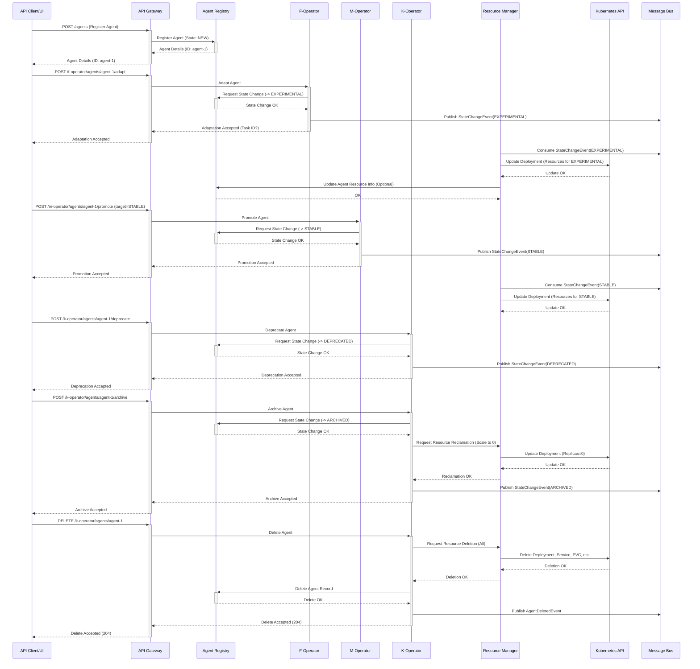
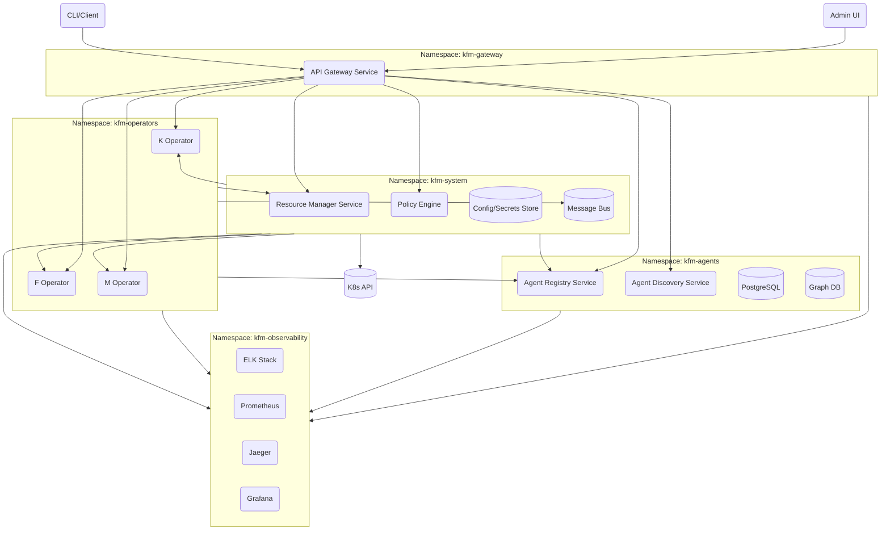

# KFM-AE System Architecture

This document provides a high-level overview of the Kubernetes Fleet Manager for Autonomous Entities (KFM-AE) system architecture.

## Component Diagram

The following diagram illustrates the main services and their primary interaction pathways:

```mermaid
graph TD
    subgraph User/Admin Interface
        AdminUI[Admin UI (kfm-admin-ui)]
        CLI/APIClient[CLI / API Client]
    end

    subgraph Core Services
        APIGateway[API Gateway Service]
        AgentRegistry[Agent Registry Service]
        DiscoveryService[Agent Discovery Service]
        ResourceManager[Resource Manager Service]
        PolicyEngine[Policy Engine]
    end

    subgraph Operators
        KOperator[K Operator (Kill)]
        FOperator[F Operator (Adapt)]
        MOperator[M Operator (Marry)]
    end

    subgraph Data Stores
        PostgresDB[(PostgreSQL)]
        GraphDB[(Graph DB)]
        ConfigStore[(Config/Secrets Store)]
    end

    subgraph Observability
        Logging[Log Aggregation (ELK)]
        Metrics[Metrics (Prometheus)]
        Tracing[Tracing (Jaeger)]
        Dashboards[Dashboards (Grafana)]
    end

    subgraph Infrastructure
        Kubernetes[Kubernetes API]
        MessageBus[Message Bus (RabbitMQ)]
    end

    %% Interactions
    AdminUI --> APIGateway
    CLI/APIClient --> APIGateway

    APIGateway --> AgentRegistry
    APIGateway --> DiscoveryService
    APIGateway --> KOperator
    APIGateway --> FOperator
    APIGateway --> MOperator
    APIGateway --> PolicyEngine
    APIGateway --> ResourceManager

    AgentRegistry --> PostgresDB
    AgentRegistry --> GraphDB

    KOperator --> AgentRegistry
    KOperator --> ResourceManager
    KOperator --> MessageBus

    FOperator --> AgentRegistry
    FOperator --> ResourceManager
    FOperator --> MessageBus
    FOperator --> Kubernetes # Potentially for adaptation jobs

    MOperator --> AgentRegistry
    MOperator --> ResourceManager
    MOperator --> MessageBus

    PolicyEngine --> AgentRegistry
    PolicyEngine --> KOperator
    PolicyEngine --> FOperator
    PolicyEngine --> MOperator
    PolicyEngine --> ConfigStore

    ResourceManager --> AgentRegistry
    ResourceManager --> Kubernetes
    ResourceManager --> MessageBus
    ResourceManager --> ConfigStore # For Quotas

    DiscoveryService --> AgentRegistry

    %% Shared Dependencies
    CoreServices --> ConfigStore
    Operators --> ConfigStore
    
    %% Observability Connections
    APIGateway --> Logging
    APIGateway --> Metrics
    APIGateway --> Tracing
    AgentRegistry --> Logging
    AgentRegistry --> Metrics
    AgentRegistry --> Tracing
    KOperator --> Logging
    KOperator --> Metrics
    KOperator --> Tracing
    FOperator --> Logging
    FOperator --> Metrics
    FOperator --> Tracing
    MOperator --> Logging
    MOperator --> Metrics
    MOperator --> Tracing
    PolicyEngine --> Logging
    PolicyEngine --> Metrics
    PolicyEngine --> Tracing
    ResourceManager --> Logging
    ResourceManager --> Metrics
    ResourceManager --> Tracing
    DiscoveryService --> Logging
    DiscoveryService --> Metrics
    DiscoveryService --> Tracing
    
    Metrics --> Dashboards
    Logging --> Dashboards
    Tracing --> Dashboards

```

## Overview

*   **User/Admin Interface:** Provides interaction points via a Web UI or CLI/API clients.
*   **API Gateway:** The single entry point for all external requests, responsible for authentication, rate limiting, and routing to backend services.
*   **Agent Registry:** The central source of truth for agent metadata, state, and dependencies, utilizing PostgreSQL and a Graph Database.
*   **K/F/M Operators:** Services responsible for specific lifecycle operations (Kill/Deprecate, Adapt/Experiment, Marry/Promote), interacting with the registry, resource manager, and potentially external systems (like Git).
*   **Policy Engine:** Evaluates configured policies based on system state and metrics to trigger automated KFM operations.
*   **Resource Manager:** Manages resource allocation/deallocation in Kubernetes based on agent state and quotas. Listens for events (like AgentKilled) to trigger reclamation.
*   **Agent Discovery:** Allows agents or users to find registered agents based on capabilities, state, etc.
*   **Data Stores:** PostgreSQL for relational data, Graph DB for dependencies, and a configuration store (e.g., K8s ConfigMaps/Secrets, Consul) for service configurations and policies.
*   **Message Bus:** Facilitates asynchronous communication and event-driven workflows between services (e.g., state change notifications).
*   **Observability:** A suite of tools (Prometheus, Grafana, ELK, Jaeger) for collecting, storing, and visualizing metrics, logs, and traces from all services.
*   **Infrastructure:** Kubernetes API for orchestration and the Message Bus for events. 

## Sequence Diagram: Agent Lifecycle (Happy Path)

This diagram shows the sequence of interactions for a typical agent lifecycle:



## Deployment Diagram (Logical Namespaces)

This diagram shows a potential logical grouping of services into Kubernetes namespaces.

