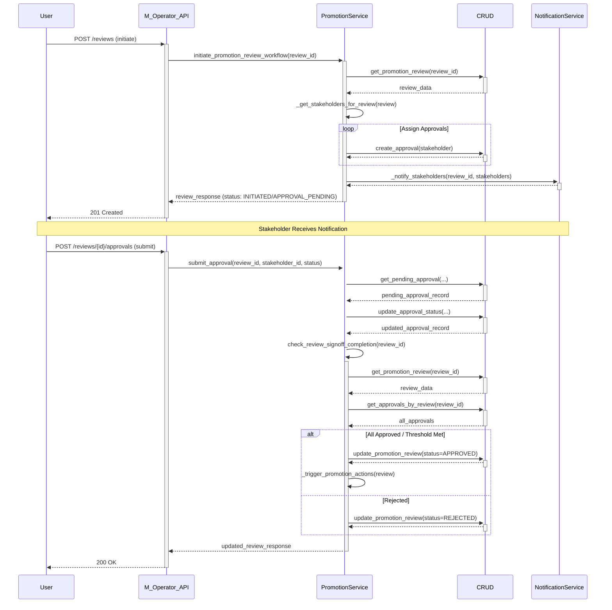

# Promotion Workflow

This document describes the promotion process managed by the M Operator Service.

## Overview

(Add high-level description)

## Approval Workflow

1.  **Initiation:** A promotion review is initiated (e.g., via POST `/api/v1/promotions/reviews`).
2.  **Stakeholder Assignment:** Based on the `workflow_type` (defined in `config/default-config.yaml`), the `promotion_service` identifies required stakeholder roles and creates pending `PromotionApproval` records.
3.  **Notification:** Stakeholders are notified (placeholder).
4.  **Sign-off:** Stakeholders submit their approval/rejection via POST `/api/v1/promotions/reviews/{review_id}/approvals`.
5.  **Status Update:** The `promotion_service` updates the `PromotionApproval` record.
6.  **Completion Check:** The service checks if all required approvals are met or if a rejection occurred.
7.  **Review Update:** The `PromotionReview` status is updated to `APPROVED` or `REJECTED`.
8.  **Promotion Actions (if APPROVED):** Triggers actions defined in Subtask 7.4 (placeholder).

## Sequence Diagram

## Configuration

Approval workflows are defined in `config/default-config.yaml` under the `approval_workflows` key. 