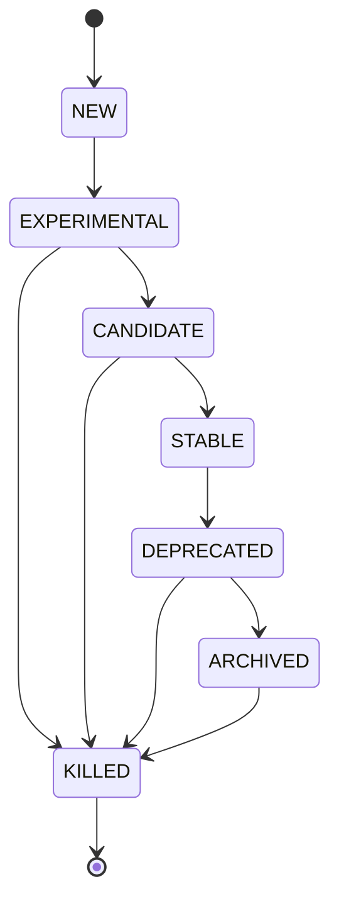

# Agent Lifecycle State Machine

This document describes the state machine implemented in `agent_registry_service.core.state_machine` to manage the lifecycle of agents within the KFM-AE system.

## Overview

The state machine ensures that agents transition through defined lifecycle states in a controlled and auditable manner. It enforces valid transitions, logs the history of changes, and provides hooks for triggering actions based on state changes.

## States

The following lifecycle states are defined in the `AgentState` Enum:

-   **NEW**: The initial state for a newly registered agent.
-   **EXPERIMENTAL**: The agent is under development and testing. It may not be stable or fully functional.
-   **CANDIDATE**: The agent has passed initial tests and is a candidate for becoming stable. It may undergo further validation.
-   **STABLE**: The agent is considered reliable, has passed all required checks, and is suitable for general use.
-   **DEPRECATED**: The agent is planned for retirement and should not be used for new implementations. A replacement may be available.
-   **ARCHIVED**: The agent is no longer actively maintained or used, but its records and potentially resources are kept for historical purposes.
-   **KILLED**: The agent and its associated resources have been permanently removed or deactivated.

## State Transitions

The following diagram illustrates the allowed transitions between states:



*Note: Transitions directly from `CANDIDATE` back to `EXPERIMENTAL` might be considered based on future requirements but are not enforced by the current `ALLOWED_TRANSITIONS` dictionary.* 
*Note: `KILLED` is a terminal state.* 

## Usage

The `StateMachine` class provides the core functionality.

### Initialization

```python
from agent_registry_service.core.state_machine import StateMachine, AgentState

# Initialize in the default NEW state
sm = StateMachine()

# Or initialize in a specific state
sm = StateMachine(initial_state=AgentState.EXPERIMENTAL)
```

### Checking Current State

```python
current_state = sm.current_state
print(f"Current state: {current_state.value}")
```

### Validating Transitions

Before attempting a transition, you can check if it's allowed:

```python
if sm.validate_transition(AgentState.EXPERIMENTAL):
    print("Transition to EXPERIMENTAL is allowed.")
else:
    print("Transition to EXPERIMENTAL is NOT allowed.")
```

### Performing Transitions

Use the `transition_to` method to change the state. Provide an optional `context` dictionary for logging.

```python
from agent_registry_service.core.state_machine import InvalidTransitionError

context = {"user_id": "admin", "reason": "Initial testing phase"}
try:
    sm.transition_to(AgentState.EXPERIMENTAL, context=context)
    print(f"New state: {sm.current_state.value}")
except InvalidTransitionError as e:
    print(f"Transition failed: {e}")
```

### Accessing State History

The history of transitions is logged automatically.

```python
history = sm.state_history
# history is a list of tuples: (from_state, to_state, timestamp, context)
for entry in history:
    from_s, to_s, ts, ctx = entry
    print(f"{ts}: {from_s.value if from_s else 'Initial'} -> {to_s.value} (Context: {ctx})")
```

### Using Transition Hooks

Register callback functions to be executed after a successful transition.

```python
def my_notification_hook(from_state, to_state, context):
    print(f"Hook triggered: Transitioned from {from_state.value} to {to_state.value}")
    # Add logic here, e.g., send notification, update external system

sm.register_transition_hook(my_notification_hook)

# Now, when sm.transition_to(...) is called successfully, 
# my_notification_hook will be executed.
```

## Integration

The state transitions are primarily managed via the Agent Registry Service API endpoint `PUT /api/v1/agents/{agent_id}/state`. The underlying CRUD operation (`crud_agent.update_state`) should ideally utilize this `StateMachine` internally to validate transitions before persisting the state change to the database. 